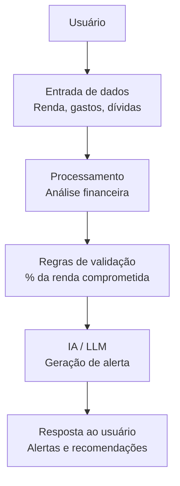

# Documentação do Agente

## Caso de Uso

### Problema
> Qual problema financeiro seu agente resolve?

Muitas pessoas não conseguem controlar seus gastos ao longo do mês e só percebem o problema quando o dinheiro já está acabando ou quando entram no limite do cartão de crédito. A falta de acompanhamento em tempo real dificulta a tomada de decisão e pode levar ao endividamento.

### Solução
> Como o agente resolve esse problema de forma proativa?

O agente atua de forma proativa monitorando os gastos do usuário com base na sua renda e despesas registradas. Ele analisa o percentual de renda já comprometido e identifica riscos, como excesso de gastos ou aproximação do limite financeiro.

### Público-Alvo
> Quem vai usar esse agente?

O agente é voltado para pessoas que desejam melhorar sua organização financeira, especialmente:
-  Pessoas com dificuldade em controlar gastos mensais;
-  Usuários com renda limitada que precisam evitar endividamento;]

---

## Persona e Tom de Voz

### Nome do Agente
FinGuard (Agente Financeiro de Alerta de Gastos)

### Personalidade
> Como o agente se comporta? (ex: consultivo, direto, educativo)

- Consultiva
- Educativa
- Proativa

### Tom de Comunicação
> Formal, informal, técnico, acessível?

Acessível, educativa e semi-formal.

### Exemplos de Linguagem
- Saudação: "Olá! Estou aqui para te ajudar a cuidar melhor das suas finanças. Como posso te ajudar hoje?"
- Confirmação: "Entendi! Vou analisar suas informações e já te passo algumas orientações para melhorar seu controle financeiro."
- Erro/Limitação: "No momento, não tenho todas as informações necessárias para uma análise completa, mas posso te orientar com algumas dicas gerais para melhorar sua organização financeira."

---

## Arquitetura

### Diagrama 

### Componentes

| Componente | Descrição |
|------------|-----------|
| Interface | Chatbot em Streamlit |
| LLM | GPT-4 via API |
| Base de Conhecimento | JSON/CSV com dados do cliente, incluindo renda, gastos e categorias financeiras |
| Validação | Regras de negócio para checagem de limites de gastos e prevenção de respostas inconsistentes |

---

## Segurança e Anti-Alucinação

### Estratégias Adotadas

- [x] O agente responde apenas com base nas informações fornecidas pelo usuário (renda, gastos e despesas).
- [x] Quando não possui dados suficientes, informa a limitação e oferece orientações gerais.
- [x] Utiliza regras de validação, como percentual de renda comprometida, para evitar respostas incoerentes.
- [x] Evita recomendações de investimento ou crédito sem conhecer o perfil financeiro completo do usuário.

### Limitações Declaradas
> O que o agente NÃO faz?

- O agente não substitui um profissional financeiro ou consultor especializado;
- Não realiza integração com dados bancários reais ou atualizações automáticas de gastos;
- Não garante previsões financeiras exatas, pois depende das informações fornecidas pelo usuário;
- Não fornece recomendações de investimento ou crédito personalizadas sem análise completa do perfil financeiro.
